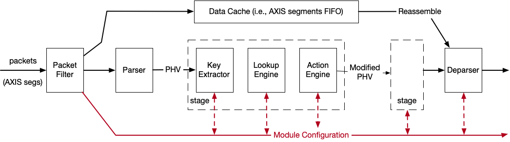
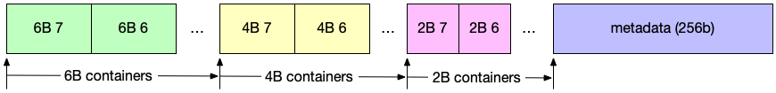
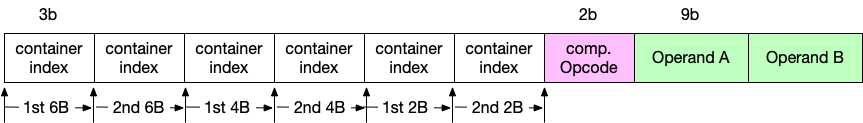
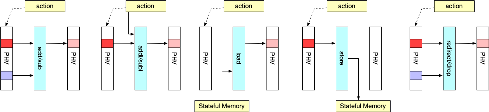
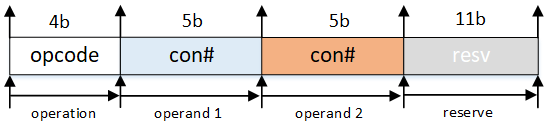
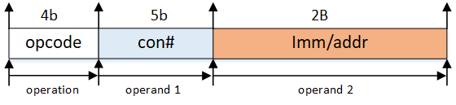
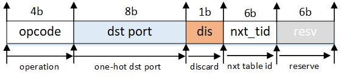
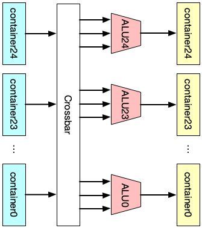
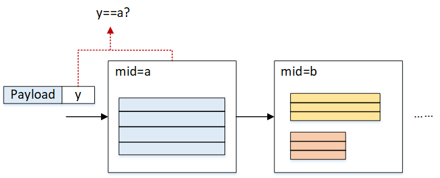
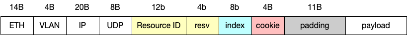

# Directory Structure

1. `./lib_rmt` is the main library folder for the pipeline.
2. `./hw_test` are examples in Python.

We thank [Alex Forencich](https://github.com/alexforencich)'s
[Corundum](https://github.com/corundum/corundum) support and also the NetFPGA
and [FlowBlaze](https://github.com/axbryd/FlowBlaze) team.

# Design notes



The whole processing pipeline has `4` main modules: (1) `packet filter`, (2) `programmable parser`, (3) several processing `stage`s, each consists of (a) `key extractor`, (b) `lookup engine` and (c) `action engine`, (4) `programmable deparser`.

In general, packets (i.e., AXIS segments) enter the pipeline. They are pushed into two different paths, namely the `module configuration` and `data packets` paths.

`data packets` will be stored into the `data cache` and passed to `programmable parser` to generate `PHV`, which will be fed into the `stage`s and reassembled by the `programmable deparser` with the original data packets stored in the `data cache` before the packets go out the whole pipeline. 

`module configuraiton` packets are used to update the table entries inside those different modules in different stages.

**The meaning of module throughout this note is the self-contained program logic rather than the whole program as we indicate in the paper.**

------

### **Data Plane Design**

#### Packet filter

Here, we simple assume that packet format is Ethernet, VLAN, IP, UDP header followed by UDP payload where users can define their own custom headers.

We have a simple indicator to check whether the packet is a `module configuraton` packet. Basically, we have a in-hardware cookie to match against the field in the packet, and a specific destination UDP port (i.e., h'f1f2) for those `module configuraton` packets.

Also, to ensure every data packet will not be processed by partitial configurations, we will drop every data packet if its VLANID matches the specific user ID.

------

#### Parse Action

one parse action is a 16-bit configuration, each user (i.e., identified by VLAN ID) has 10 such parse actions.

* `[15:13]` reserved
* `[12:6]`  byte number from 0
* `[5:4]` container type number, `01` for 2B, `10` for 4B, `11` for 6B
* `[3:1]` container index
* `[0]` validity bit

---

#### Packet Header Vector (PHV)

After parsing, the pipeline works on the PHV generated. In our design, the PHV contains **packet header** (defined by the user) and **metadata** (ingress port, length, etc.). (NOTE: the order of container index is in decreasing order)

  


Above is the format of PHV in our design  ```|8x6B|8x4B|8x2B|256b|```. Basically, we have 3 types of PHV containers of different sizes (i.e., 6B, 4B, 2B) and one giant container for metadata, which is in total 256b:

  * `768b`:  the packet header value container. It contains 8x 6B, 4B and 2B to store values that will be used in the match-action stage.
  * `256b`:  the metadata attached to the packet. The lower 128b, namely `[127:0]`, is for the NetFPGA's `tuser` so that it follows the [NetFPGA's specifications](https://www.cl.cam.ac.uk/research/srg/netos/projects/netfpga/workshop/technion-august-2015/material/slides/2015_Summer_Camp_Day_1.pdf) (e.g., SRC, DST ports, etc.). The 128th bit is termed as the drop mark, where 1 means dropping.

> * `[255:141]` is reserved for other use.
> * `[140:129]` is the `VLAN ID`.
> * `[128]` is the discard flag where 1 means to drop the packet.
> * `[127:0]` is for the NetFPGA's `tuser` data.

---

#### Notes on Match-Action Table

The most important abstraction of [RMT](https://web.stanford.edu/class/cs244/papers/sdn-chip-sigcomm-2013.pdf) is match-action table. In each stage of RMT, multiple match-action tables can be placed. For simplicity, we only place one in each stage.

------

  #### Key Extractor

The `key extractor` will extract the key out of PHV according to the instructions in the RAM. Specifically, in our design, we use the `VLAN ID` (i.e., `PHV[140:129]`) to index the instruction RAM in `key extractor` and then according to the instruction to extract the key from PHV.

The format of this instruction is shown below:



Basically, we have allocated `2` containers for each type and appended an comparator to support `if` statement in the p4 action.

- index is a `3b` width digit to indicate which container of each type is used to construct the key.
- comparison opcode is a `2b` width digit, where `00` --> `>`, `01` --> `>=`, `11` --> `==`.
- operand is a `9b` width digit, where the bit `operand[8]` indicates whether it is a immediate operand, if so, the next 8 bits respresents the value. Otherwise, the `operand[7:5]` is the index and `operand[4:3]` is the type of PHV container.

Thus, we can get a key of (2*(6+4+2)B+1=)193b, where and the last bit is the result of comparator.

Together with a `key mask` obtained from RAM using `VLAN ID`, the key is fed to the next module.

---

  #### Lookup Engine

`lookup engine` takes the key and key mask from `key extractor`, conducts a matching operation and outputs an VLIW-style `action` which determines the actions that need to execute in the `action engine`.


  * Format of the lookup table entry
  
    each entry is 205b, where the first 12b is the `VLAN ID` and next 193b is the key from `key extractor`.
  
  * VLIW-style action table entry
  
    each entry contains 25x25b (625b in total) sub-actions, indicating how the PHV is going to be modified in the `action engine`.

For the match part, we directly use the [Xilinx CAM](https://www.xilinx.com/support/documentation/application_notes/xapp1151_Param_CAM.pdf) to implement exact matching.

---

  #### Action Engine

`action engine` takes the `action` output from `lookup engine`, and modifies PHV according to it. The actions that will be supported in the demo include `add`, `addi`, `sub`, `subi`, `load`, `loadd`, `store`, `redirect port`, `discard`.

  

  1. `add`: takes two operands from the PHV based on the indexes in the action field, add them, and write the result back to the location of 1st operand.
  2. `addi`: takes one operand from PHV based on the index in the action field and one operand from the action field directly, add them, and write the result back to the location of operand. 
  3. `sub`: takes two operands from the PHV based on the indexes in the action field, substract the 2nd operand from the 1st, and write the result back to the location of 1st operand.
  4. `subi`: takes one operand from the PHV based on the index in the action field and one from the action field directly, substract the 2nd operand from the 1st, and write the result back to the location of 1st operand.
  5. `load`: read the value from PHV based on the index in the action field. Then use the value as address from the stateful memory, write it into PHV according to the index of the 1st operand.
  6. `loadd`: read the value from PHV based on the index in the action field. Then use the value as address from the stateful memory. increment by 1. And write it into PHV according to the action index. Finally write it back to the RAM.
  7. `store`: read the value from PHV according to the index in the action field, write it into the address stored in the action field.
  8. `port`: send the current packet from ports listed in the action field (including multicast).
  9. `discard`: drop the current packet.
  10. `set`: set the value of PHV container to a immediate value.

  There are three types of actions: 2-operand action, 1-operand action and metadata action as is shown below.

  * Action format:
  
    For `add` (`4b'0001`), `load`(`4b'1011`), `loadd`(`4b0111'`) and `store`(`4b'1000`) and `sub` (`4b'0010`) operations, the action format is:
  
    
  
    For `addi`(`4b'1001`), `subi`(`4b'1010`), `set`(`4b'1110`), the action format is:
  
    
  
    For `port`(`4b'1100`) and `discard`(`4b'1101`), the action format is:
  
    

    The default action field is `0x3f`, which can be seen if no action is matched.


In order to support VLIW (very long instruction word) in the action engine, there are 24 standard ALUs hard-wired with 24 containers in the PHV, and also 1 extra ALU to modify the metadata field in the PHV. A workflow of the action engine can be shown in the figure below:


  

  * Support for Memory-related operations in multi-tenancy

    In the multitenancy scenario, the `action engine` needs to isolate the memory resources among each tenant for security reasons. In this regard, each tenant should be given a specific range of memory slot and must not access other slots. Moreover, elastic memory allocation is supported for efficient usage of such resources when both state-intensive tenants and other tenants' program running on the same device (Switch/NIC).

    In order to support memory isolation between tenants, a `segment table` should be matched before read/write any data using `load/store`. The table size is 16bx16. The format:

    | vlan_id | length | base_addr |
    | ------- | ------ | --------- |
    | 0       | 16     | 0x12      |
    | 1       | 12     | 0x00      |
    | ...     | ...    | ...       |

    where `VLAN ID` is the key, `base_addr` (8b) and `length` (8b) is the entry content. During a `load/loadd/store` operation, only operations whose `addr` is within the `length` can be executed. Otherwise, the request will be dropped.

    

    In our implementation, for simplicity, `store`/`load`/`loadd` supports only 4B (32b) operations, while all other actions support all 2B, 4B and 6B operands.

---

  #### Programmable Deparser

`programmable deparser` is used to reassemble the packet header using info from the original packet header and PHV. Generally, it conducts the process in the reverse direction of `programmable parser`.

---


  ### **Control Plane Design**

  In order to write/read table entries in the pipeline, a control plane is added and described in this section.

  #### The Method

  

We designed a stateless method to modify the table enties in the pipeline. Specifically, we use a specialized group of packets (i.e., `module configuration` packets) to modify the table entries. The packet can be generated from the software side and contains the info about which table and how the table will be modified.

In the packet header field, there are fields indicating which module (using module ID) the configuration packets are targetting. The content of the table entry is contained in the payload field. when the packet is received by the pipeline, it will be recognized by the modules and will travel all the way through the pipeline.

Each module will check whether it is the target of the packet: if so, the module will read out the payload and modify the table entry accordingly. Otherwise, it will pass the packet to the next module. If no former module matches the packet's target, before the packet comes out of the pipeline, the deparser module will drop it no matter it matches or not.

  #### Table Types

  There are several types of tables that need to be maintained using control plane.

  1. **Parsing Table**: This is a ***160x16 RAM*** that stores the info about how to extract containers out of the first 1024b of the packet. This table is duplicated in both **Parser** and **Deparser**.
  2. **Extracting Table**: This is a ***38x16 RAM*** that indicates how the keys are generated from PHV. This table is in **Key Extractor**. Be noted that each entry of the table should be used concurrently with a mask entry, indicating which bit should be masked (ignored).
  3. **Mask Table**: This is a ***193x16 RAM*** that masks certain bits in the key field. It is also in **Key Extractor**. 
  4. **Lookup Table** (TCAM): This is a ***205x16 TCAM*** that serves as the lookup engine in the RMT pipeline. It is in **Lookup Engine**.
  5. **Action Table**: This is a ***625x16 RAM*** that stores VLIW instruction sets. It is also in **Lookup Engine**.
  6. **Segment Table**: This is a **16x16 RAM** that get the allocated range of stateful memory of each user. It is in the **Action Engine**.
  7. **Key-Value Table**: This is a ***32x32 RAM*** that supports the key-value store in RMT pipeline. It is in **Action Engine**.

  #### Data Structures

  1. Resource ID
     
      Resource ID is used to identify the corresponding module in which stage in the pipeline.

  2. Control Packet Header

      The Control Packet Header takes the advantage of Resource ID to identify the specific module, and modify the table accordingly. the format is shown below:

      

      1. `resource ID (|5b|3b|4b|)`: the first 5b is the stage number, the next 3b is the module ID. 
      2. `resv`: reserve field, can be used when there are multiple tables in a module.
      2. `index`: the index of the table entry.
      3. `padding`: used to make sure the payload starts in **the 2nd 512b** of the packet (for easier engineering).
      4. `payload`: the content of the table entry, its flexible in length.

      **We use `0xf1f2` (Big Endian) as the destination port in the UDP header for RMT control packets.**


  3. Control Packet Payload
  
      To make things easier, we want each packet to be able to modify a whole table entry at a time. In order to achieve the goal. the packet length is flexible according to which table it is targeting. For example, if we are going to modify the entry of lookup table, we will only use the highest 205 bits of the payload field.
      Another design choice we made was: the control packet supports write multiple table entries with a single packet. This is enabled by adding more payload after the 1st entry.

  #### Implementation Details

  1. We made each table dual-port RAM or CAM, thus making sure that the control packet will have no influence on the data path in all the modules. The entries will be modified using the write port.

  2. The 2nd layer index (lowest 3b) of the Module ID is: **0x0** for Parser, **0x1** for Key Extractor, **0x2** for Lookup Engine, **0x3** for Action Engine, **0x5** for Deparser.

  3. In order to have better isolation between control and data path, we **added a module (pkt_filter) in front of the  pipeline to filter out control packets**, and feed the control packets to the pipeline using a different AXIS channel.

  #### Security Concern (Deprecated)

One of the security threat that must take into consideration is "attackers may send malicious control packets". To avoid this, the control path leverages a cookie mechanism to ensure only privileged user (i.e., service provider) who knows the cookie value are able to configure the hardware.

Specifically, the cookie is a 4B width value put before the padding field in control packets, and is verified in `pkt_filter`. The cookie is updated every 400 seconds (8min). In order to issue a table update, the CPU needs to firstly read out the cookie via PCIe (using AXIL) and patch the cookie in the padding field. Once the control packets reach the pipeline, `pkt_filter` checks whether the cookie value matches: if so, the table reconfiguration will be issued successfully; otherwise, the control packet will be treated as illegal and will be dropped.

Two key points regarding cookie implementation:

1. **Cookie register:** Cookie register is 32b-wide. The cookie value is updated using a hash method in every 480s (8min, using a self-managed timer). The method is shown as `cookie = cookie ^ (key>>16) ^ key`, where the `key` is the lowest 32b of the self-managed timer.
2. **Read cookie from CPU:** While the cookie is updated on the FPGA part, it can be read out using software via PCIe. We use AXIL for this purpose.


---
  #### Random notes 

    1. According to RMT, which match table the packet is going through is determined by the result (action) of the last match. In this way it forms a TTP (see TTP in OpenFlow).
    
      > The `control flow` in the orignal RMT paper is done by giving each table an **index** (stage NO) and judging whether the PHV should be handled in the current stage by matching the **index** with a specific field in the `metadata`. Noted that the field in metadata that controls the control flow is modified by the action in each stage.
    
    2. Another question worth to ask is how to determine which fields in the container is going to be matched in the current stage.
    
      > One method would be using TCAM for the match table and masking the fields that we don't care. (This is how Menshen tackles the issue).
    
    3. Different from the original RMT, we use a lookup table to support flexible key extraction from `PHV`. This is added in order to support multi-tenants scenarios, as different users may put the fields they are interested in into different PHV containers.
